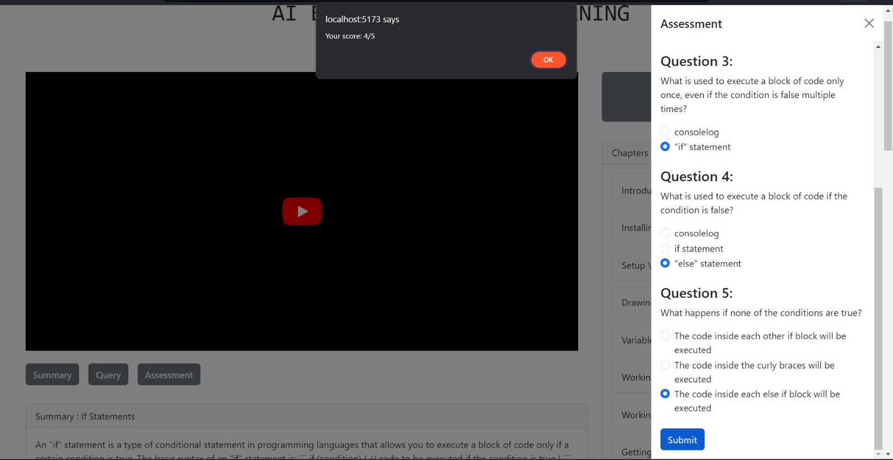

# YouTube Learning Platform

## Introduction

This project aims to facilitate learning from YouTube videos by providing automatic assessment generation based on the video content.

When a user shares a YouTube link:

* The platform extracts chapters from the video and generates summaries for each chapter using the transcript.
* Users can query the platform if they encounter difficulties understanding certain concepts.
* Assessments are generated based on the content covered in each chapter, aiding in efficient learning.

## Installation

1.  **Clone the repository:**

    ```bash
    git clone [https://github.com/TaherTadpatri/youtubeLearning.git](https://github.com/TaherTadpatri/youtubeLearning.git)
    ```

### Frontend

1.  **Navigate to the frontend directory:**

    ```bash
    cd frontend
    ```

2.  **Install dependencies:**

    ```bash
    npm install
    ```

3.  **Run the development server:**

    ```bash
    npm run dev
    ```

    React server will be running on `localhost:5173`.

### Backend

1.  **Navigate to the backend directory:**

    ```bash
    cd backend
    ```

2.  **Create and activate a virtual environment (recommended):**

    ```bash
    python -m venv venv
    source venv/bin/activate  # On macOS/Linux
    venv\Scripts\activate  # On Windows
    ```

3.  **Install dependencies:**

    ```bash
    pip install -r requirements.txt
    ```

4.  **Make migrations and run the development server:**

    ```bash
    python manage.py makemigrations
    python manage.py migrate
    python manage.py runserver
    ```

    Django server will be running on `localhost:8000`.

### Dependencies

Install all necessary dependencies listed in `requirements.txt` and `package.json`. Additionally, install the following:

* **Ollama:** [https://ollama.com/](https://ollama.com/) (Install both the application and the Python library via `pip install ollama`).
* **Desired Model (e.g., DeepSeek):** Download and run the desired model via Ollama (e.g., `ollama run deepseek-coder`).
* **Question and Answer Generation Model:**
    * Download the repository from [GitHub](https://github.com/KristiyanVachev/Leaf-Question-Generation).
    * Place the downloaded repository in the `./backend/app/` directory.

**Note:** If you encounter issues with the code, please raise an issue on the GitHub repository.

## Results

1.  **Chapters of the YouTube video:**

    

2.  **Summary of a chapter:**

    

3.  **Query response:**

    

4.  **Assessment:**

    
